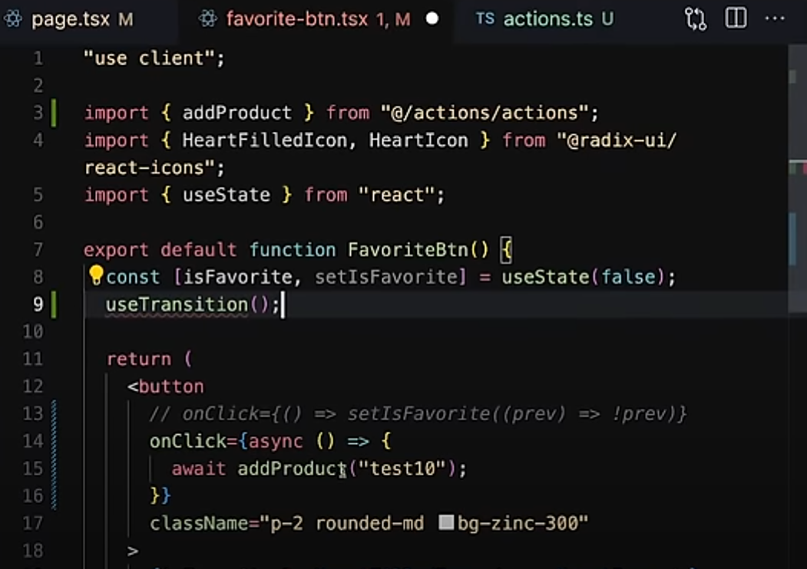
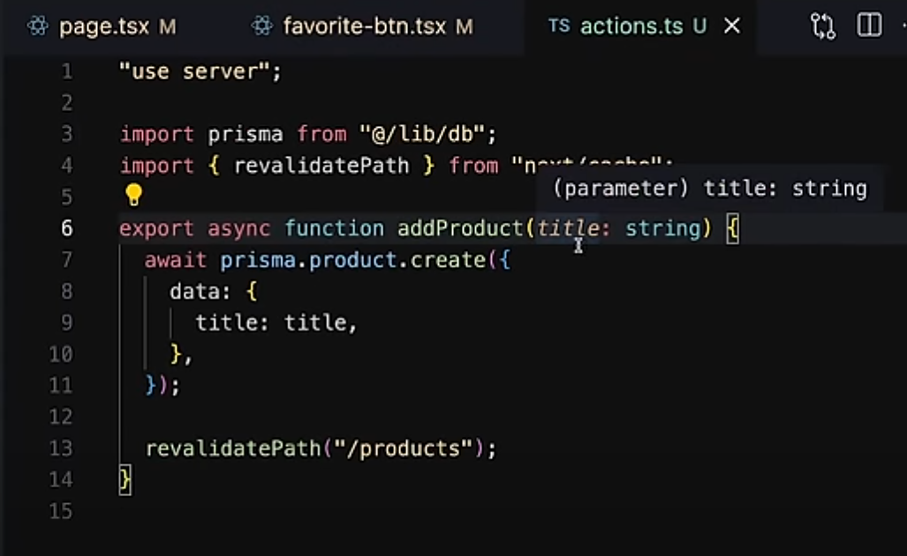
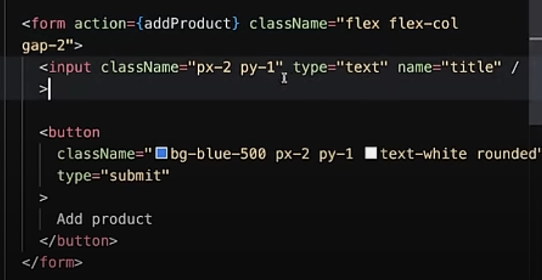
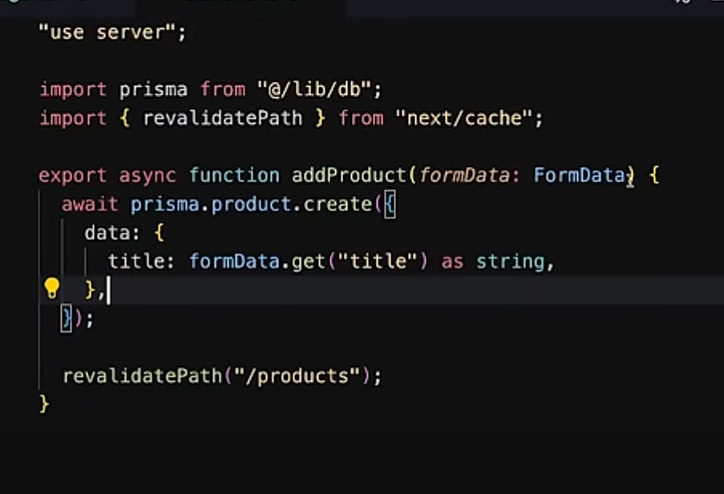
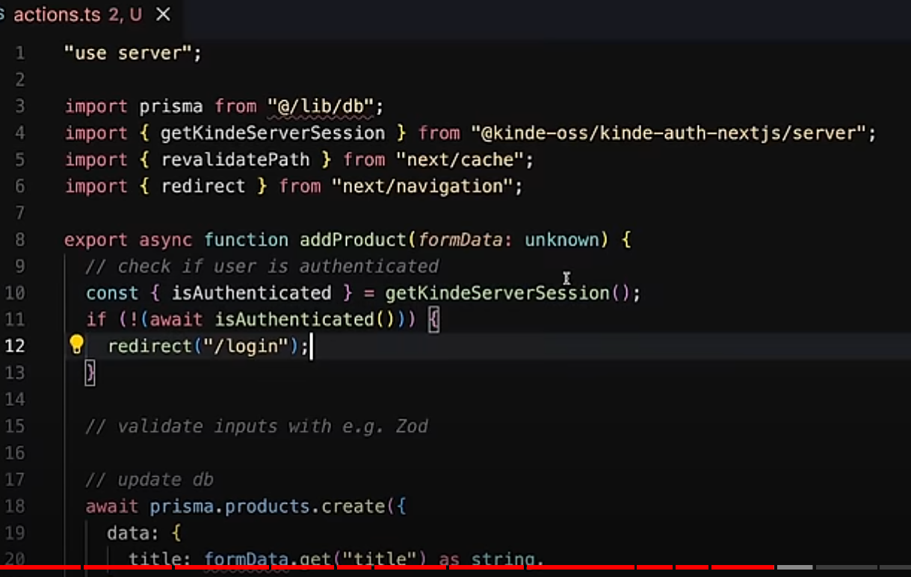
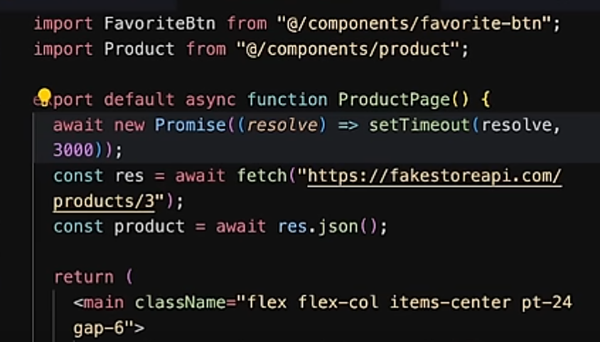
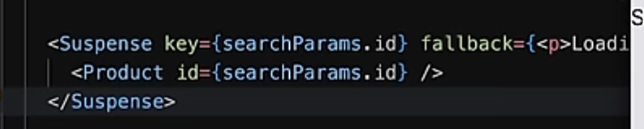
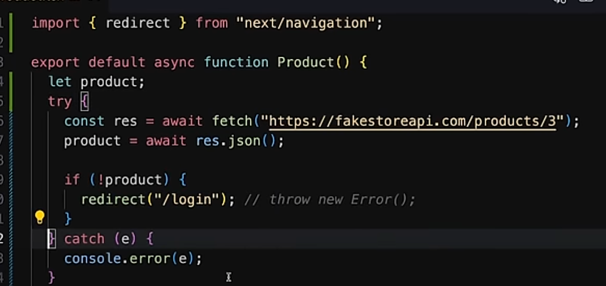
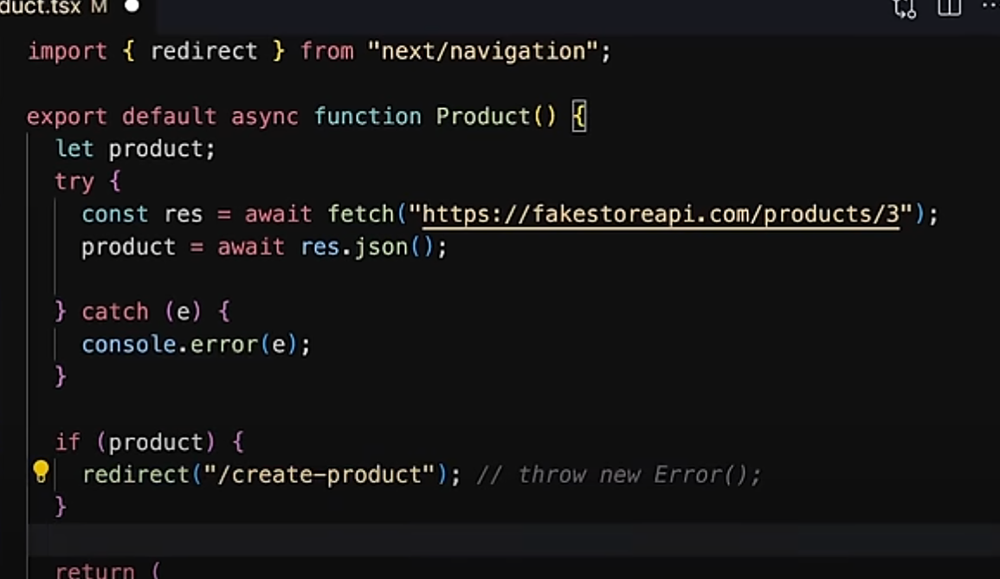

# parallel fetching
usually there are fetching (async await) it does that in a waterfall manner means like a step(stair). one is finish then other is started (good when next is depend on prev) but if the both function are independent we can do that in parallel saving the runtime.
so we use Promise.all
> const[data1,data2]=Promise.all([getdata1(),getdata2()])
here if one get wrong all are mark wrong

> const[data1,data2]=Promise.allSettled([getdata1(),getdata2()])
but settled makes only the one wrong, wrong.

# server action can also be done in client

# normal server action in server component
 
> button has type="submit"

### also remember to validate and auth

## adding a timeout

### fallback need to be above await

### if changes happens in suspense

put key so that if the key changes the fallback will happen(trigger)

## redirect cant be use in trycatch

error

the correct way is 
